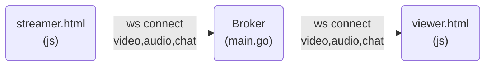
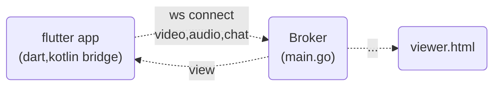

MJPEG Stream Broker (golang)
---
## Description
MJpeg Websocket Broker
- data: video, audio, chat, timestamp
- sync buffer structure
## Architecture
### main.go

### expansion

### IDE Setting
* intellij  
  Go 모듈이 활성화되어 있는지 확인(해당되는 경우):
  * go module 기반 프로젝트인 경우(go.mod 파일 확인)
  * install go plugin
  * Settings -> Languages & Frameworks ->    
    Go -> Go Modules, Enable Go modules integration 체크
* vscode
  * install go plugin
## Execute
### Command
* run
  ```bash
  go run main.go
  ```
