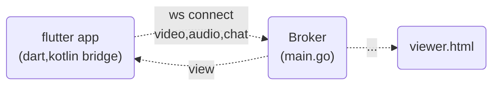

# mjpegstreamer

## Description
Mjpeg Stream Flutter project.

## Architecture


## Pre-requisite
* Flutter <-> Kotlin Native Bridge
  ```mermaid
  flowchart TD
    A("Flutter app<br>(Dart)") -->|"callMethod(args)"| B("MethodChannel") 
    B -->|"Kotlin Native Bridge<br>(aos)"| C("calledMethod()")
    C --> D("Camera2 API")
    D --> E("HAL<br>Camera,Audio,Sensor, ...")
    B -->|"Kotlin<br>JNI"| F("NDK<br>(C/C++)")
    F --> E
    
  ```

## Debug report
* 웹소켓 연결시 네트워크 에러
    * res/xml/network-security-config.xml
  ```xml
  <?xml version="1.0" encoding="utf-8"?>
    <network-security-config>
        <domain-config cleartextTrafficPermitted="true">
            <domain includeSubdomains="true">192.168.0.102</domain>
            <domain includeSubdomains="true">192.168.0.103</domain>
            <domain includeSubdomains="true">192.168.0.104</domain>
            <domain includeSubdomains="true">192.168.0.105</domain>
            <domain includeSubdomains="true">192.168.0.106</domain>
            <domain includeSubdomains="true">192.168.0.107</domain>
            <domain includeSubdomains="true">192.168.0.108</domain>
            <domain includeSubdomains="true">192.168.0.109</domain>
        </domain-config>
    </network-security-config>

  ```
## Knowledge
* @Volatile
    * 하나의 인스턴스만 생성 : 메인 메모리에 저장 명시
*
## Getting Started

This project is a starting point for a Flutter application.

A few resources to get you started if this is your first Flutter project:

- [Lab: Write your first Flutter app](https://docs.flutter.dev/get-started/codelab)
- [Cookbook: Useful Flutter samples](https://docs.flutter.dev/cookbook)

For help getting started with Flutter development, view the
[online documentation](https://docs.flutter.dev/), which offers tutorials,
samples, guidance on mobile development, and a full API reference.
