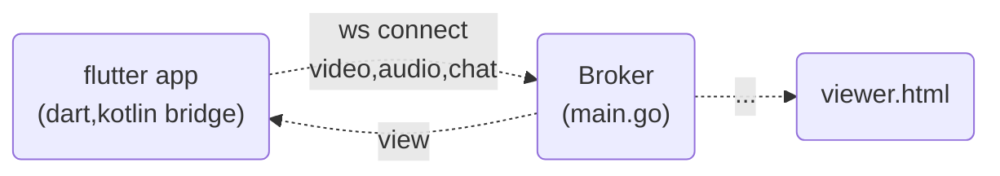

# 🌀 MJPEGStreamer (Flutter + Kotlin + WebSocket)

## Description
**MJPEGStreamer** is a hybrid Flutter application that captures Android device camera frames using a **Kotlin bridge**, encodes them into MJPEG format, and streams them via **WebSocket** to a remote **Go-based broker server**.

It's not just another streaming app — it's a cross-platform, modular, and broker-oriented streaming architecture.  

---

## Architecture

```mermaid
flowchart LR
    A("flutter app<br>(dart,kotlin bridge)") -.->|ws connect<br>video,audio,chat| S("Broker<br>(main.go)")
    S -.->|...|B("viewer.html")
    S -.->|view| A
```
Flutter UI  
│  
├── Kotlin Camera Bridge (via MethodChannel)  
│ └── Accesses Android Camera (CameraX)  
│ └── Streams raw frames (JPEG) to Dart  
│  
├── WebSocket Client (Dart)  
│ └── Connects to external Broker server  
│  
└── Broker Server (written in Go)  
├── Receives frames from clients  
└── Serves MJPEG to viewers over HTTP  
> 📡 No built-in HTTP server in app but able to...  
> 🔄 All streams are routed through an external broker  
> 💬 Real-time via WebSocket, not polling

---

## 🔧 Development Environment

| Component            | Stack                     |
|----------------------|---------------------------|
| UI                   | Flutter                   |
| Camera Access        | Kotlin (via MethodChannel)|
| Streaming Protocol   | WebSocket                 |
| Broker               | Go (Golang)               |
| MJPEG Encoding       | JPEG + multipart in Broker|
| Android Support      | API 28+ (Android 9+)      |

---
## 🚀 Features

- 🎥 Native Android Camera feed using CameraX
- 🔁 Frame conversion and compression to JPEG
- 📤 Realtime frame push over WebSocket
- 🌍 Lightweight external broker handles MJPEG streaming
- 🔄 Flutter UI for control, config, and status
- 💡 Efficient & low-latency streaming path

---

## 🔌 Prerequisites

- Flutter 3.x
- Android SDK (API 28+)
- Kotlin support (via Android project module)
- Go installed for broker
- Broker server deployed and reachable via WebSocket  
* Flutter <-> Kotlin Native Bridge
  ```mermaid
  flowchart TD
    A("Flutter app<br>(Dart)") -->|"callMethod(args)"| B("MethodChannel") 
    B -->|"Kotlin Native Bridge<br>(aos)"| C("calledMethod()")
    C --> D("Camera2 API")
    D --> E("HAL<br>Camera,Audio,Sensor, ...")
    B -->|"Kotlin<br>JNI"| F("NDK<br>(C/C++)")
    F --> E
    
  ```

---
## ⚙ How It Works

1. Flutter starts and initializes Kotlin bridge
2. Kotlin captures preview frames from the camera
3. Each frame is JPEG-encoded and sent to Dart
4. Dart WebSocket client sends frames to Go broker
5. Broker exposes `http://<broker-ip>:<port>/stream/<device>` as MJPEG

---

## 📂 Project Structure
mjpegstreamer_flutter/  
├── lib/  
│ └── main.dart  
│ └── commonProvider.dart  
│ └── mjpeg_sender.dart  
│ └── mjpeg_viewer.dart  
│  
├── android/  
│ └── app/  
│ └── src/main/kotlin/  
│ └── MainActivity.kt  
│ └── Sender.kt  
│  
├── broker/ (Go server)  
│ └── main.go  
│ └── <s>stream_handler.go</s>  
│ └── <s>websocket_handler.go</s>  

---

## 🧪 Broker Usage (Go)

```bash
cd broker/
go run main.go
Server listens on:
```
* WebSocket: ws://<ip>:8080/stream/upload
* MJPEG: http://<ip>:8080/stream/<device-id>

---

## 📱 How to Use the App
1. Start the Go broker on your server or local machine.
2. Run the Flutter app on Android device.
3. Grant camera permission.
4. Streaming begins automatically to the broker.
5. Access the stream at:
  ```html
  ws://<broker-ip>:8080/ws
  ```

---

## 🧱 TODOs & Improvements
* Add bitrate and frame rate control
* Optional in-app broker mode (fallback HTTP server)
* Device authentication
* iOS support via Swift bridge
* Configurable resolution & quality

---

## ⚠️ Notes
* This project is optimized for LAN/Wi-Fi performance.
* WebSocket ensures low-latency, but it's not end-to-end encrypted by default.
* Broker must handle multipart encoding properly (see provided Go code).
* MJPEG is CPU-friendly but bandwidth-heavy.

---

## Debug report
* 웹소켓 연결시 네트워크 에러
    * res/xml/network-security-config.xml
  ```xml
  <?xml version="1.0" encoding="utf-8"?>
    <network-security-config>
        <domain-config cleartextTrafficPermitted="true">
            <domain includeSubdomains="true">192.168.0.102</domain>
            <domain includeSubdomains="true">192.168.0.103</domain>
            <domain includeSubdomains="true">192.168.0.104</domain>
            <domain includeSubdomains="true">192.168.0.105</domain>
            <domain includeSubdomains="true">192.168.0.106</domain>
            <domain includeSubdomains="true">192.168.0.107</domain>
            <domain includeSubdomains="true">192.168.0.108</domain>
            <domain includeSubdomains="true">192.168.0.109</domain>
        </domain-config>
    </network-security-config>

  ```
## Knowledge
* @Volatile  
  하나의 인스턴스만 생성 : 메인 메모리에 저장 명시

---
## 📢 License
MIT (but come on, at least star the repo if you use it, you freeloader.)