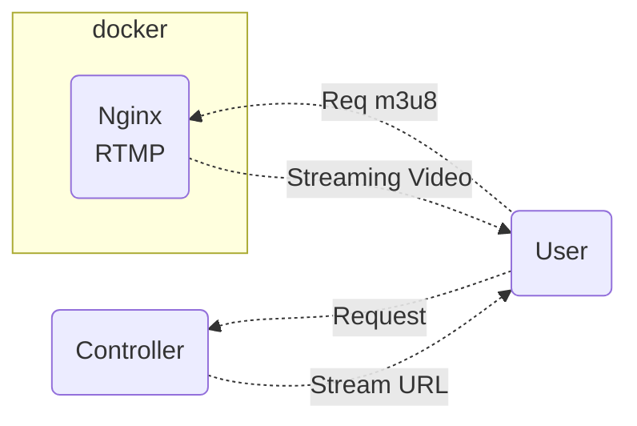

# SpringBoot relay Server
## Description
* SpringBoot : Url Broker
* Streaming : Nginx + rtmp plugin (docker)
## Architecture

### docker-compose.yml
```yaml
#version: "3.7"
services:
  nginx:
    image: alfg/nginx-rtmp
    ports:
      - "1935:1935"  # RTMP input
      - "18080:80"    # HLS 서빙
    volumes:
      - ./nginx.conf:/etc/nginx/nginx.conf
      - ./hls:/tmp/hls
    command: ["nginx", "-g", "daemon off;"]
```
### docker command
```yaml
$ docker compose up   # first time
$ docker compose start  # next time
$ docker ps # get container id
$ docker exec -it 82ce952b9db4 /bin/sh  # docker shell
```
### ports
* RTMP input : 1935
* HLS : 18080

# Getting Started
### Transfer video
* OBS
  * url : rtmp://localhost:1935/live
  * stream key : stream
* ffmpeg
  ```shell
    ffmpeg -re -i test.mp4 -c:v libx264 -c:a aac -f flv rtmp://localhost:1935/live/stream
  ```
### Receive video
* http://localhost:18080/hls/stream.m3u8
* OBS -> add Mdeia Source -> type input(url), input_format(rtmp)

### Reference Documentation

For further reference, please consider the following sections:

* [Official Gradle documentation](https://docs.gradle.org)
* [Spring Boot Gradle Plugin Reference Guide](https://docs.spring.io/spring-boot/3.5.3/gradle-plugin)
* [Create an OCI image](https://docs.spring.io/spring-boot/3.5.3/gradle-plugin/packaging-oci-image.html)
* [Mustache](https://docs.spring.io/spring-boot/3.5.3/reference/web/servlet.html#web.servlet.spring-mvc.template-engines)
* [Spring Web](https://docs.spring.io/spring-boot/3.5.3/reference/web/servlet.html)

### Guides

The following guides illustrate how to use some features concretely:

* [Building a RESTful Web Service](https://spring.io/guides/gs/rest-service/)
* [Serving Web Content with Spring MVC](https://spring.io/guides/gs/serving-web-content/)
* [Building REST services with Spring](https://spring.io/guides/tutorials/rest/)

### Additional Links

These additional references should also help you:

* [Gradle Build Scans – insights for your project's build](https://scans.gradle.com#gradle)

