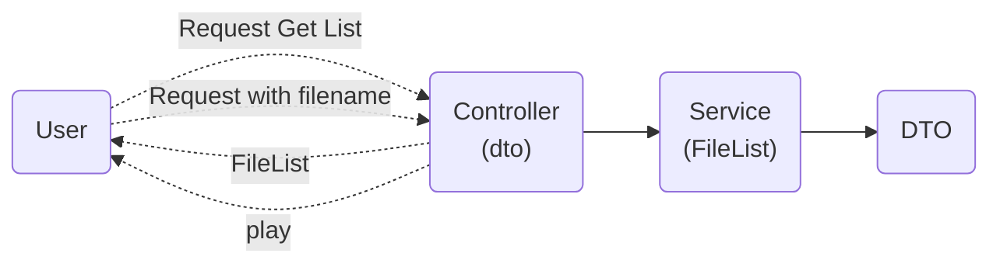

# Spring File Streaming

## Description

**file(video) streaming app by SpringBoot only**

## Architecture

## Transition
* HW
  * Local -> Cloud Database
  * Local File -> Storage -> CDN
* SW
  * local file -> cms -> cloud cms

## Getting Started

## Testing

## Run

## Reference Documentation

For further reference, please consider the following sections:

* [Official Gradle documentation](https://docs.gradle.org)
* [Spring Boot Gradle Plugin Reference Guide](https://docs.spring.io/spring-boot/3.5.3/gradle-plugin)
* [Create an OCI image](https://docs.spring.io/spring-boot/3.5.3/gradle-plugin/packaging-oci-image.html)

## Additional Links

These additional references should also help you:

* [Gradle Build Scans – insights for your project's build](https://scans.gradle.com#gradle)

